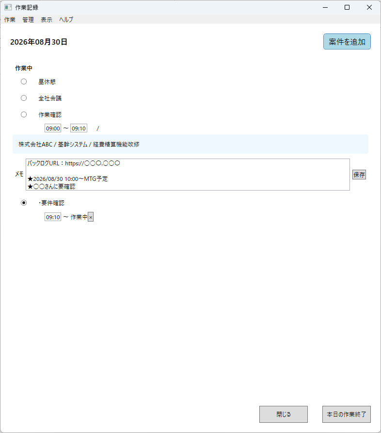
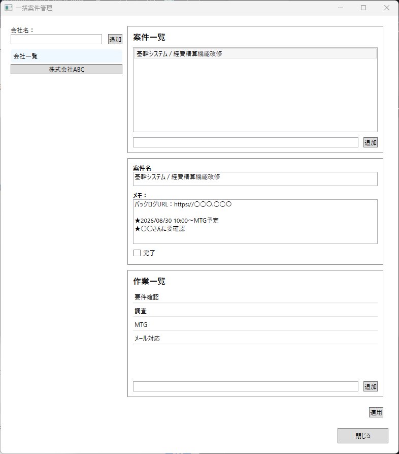
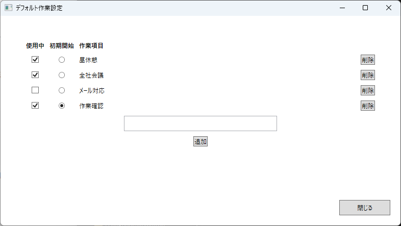
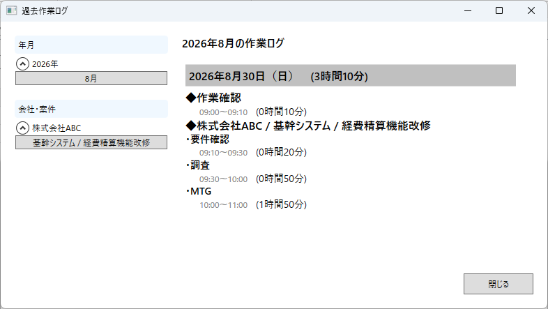
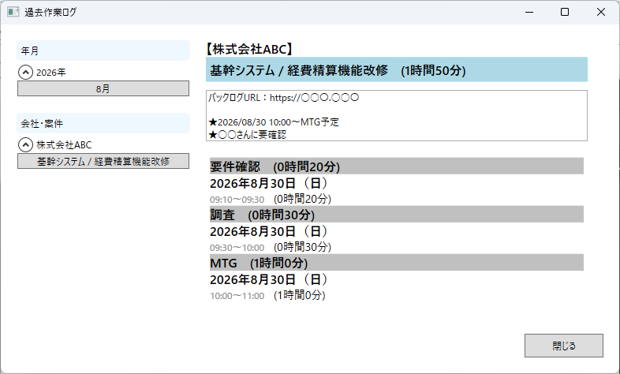

# しごとログ

日々の作業内容と作業時間を、シンプルに記録・振り返りできるWindowsデスクトップアプリです。

会社・案件・作業項目を登録し、「どの案件の、どの作業を、何時から何時まで行ったか」を記録できます。

日報の作成や、過去の作業内容・作業時間の振り返りに活用できます。

### 作業記録画面

### 一括案件管理画面

### デフォルト作業設定画面

### 過去の作業ログ

    
    

## 主な機能

- 会社・案件・作業の登録
- 作業開始・終了時間の記録
- 作業切り替え時の時間の自動記録
- 案件に属さない「デフォルト作業」の登録
- 過去の作業ログの確認
- 年月ごと、会社・案件ごとの作業履歴の確認
- 登録した会社・案件・作業の一覧確認

## インストール方法

GitHub Releasesから最新版の `ShigotoLogSetup.exe` をダウンロードしてください。

ダウンロードした `ShigotoLogSetup.exe` を実行し、画面の案内に従ってインストールしてください。

本アプリは.NETランタイムを含んだ状態で配布しているため、.NETを別途インストールする必要はありません。

> [!NOTE]
> コード署名を行っていないため、インストーラーの実行時にWindowsの警告が表示される場合があります。

## 基本的な使い方

1. 会社・案件・作業を登録
2. 「開始」ボタンから今日の作業を開始
3. 作業項目を選択して作業時間を記録
4. 業務終了時に「本日の作業終了」を選択
5. 「過去作業ログ」から記録した内容を確認

詳しい操作方法は、アプリ内の「ヘルプ」から確認できます。

## データの保存について

しごとログはオフラインで動作します。

登録した会社・案件・作業内容・作業時間などのデータは、お使いのPC内に保存されます。

外部サーバーやクラウドへの保存、インターネットを通じた作業データの送信は行いません。

データの保存場所：

`%LocalAppData%\ShigotoLog`

アプリをアンインストールしても、保存した作業データは自動では削除されません。

データも含めて完全に削除する場合は、アンインストール後に上記フォルダを手動で削除してください。

大切な作業記録については、定期的なバックアップをおすすめします。

## 開発の背景

日々の業務で複数の案件や作業を並行していると、あとから「何時間、どの案件のどんな作業をしていたか」を整理するのに手間がかかることがあります。

そこで、作業を切り替えるタイミングで時間を記録し、日報作成や過去の作業の振り返りをしやすくすることを目的として開発しました。

## 動作環境

- Windows
- 64bit

## 使用技術

- C#
- .NET 8
- WPF
- Entity Framework Core
- SQLite
- Inno Setup

## 開発環境

- Visual Studio 2022
- .NET 8

## ソースコードについて

本リポジトリでは、しごとログのソースコードを公開しています。

コードについてのご意見や改善案、不具合の報告などがありましたら、GitHub Issuesからお知らせいただけると嬉しいです。

## ローカルでの実行

1. このリポジトリをCloneします。
2. `DailyReportMemoApp.sln` をVisual Studio 2022で開きます。
3. NuGetパッケージを復元します。
4. プロジェクトをビルドして実行します。

## バージョン

### v1.0.0

初回リリース。

## ライセンス

このプロジェクトは MIT License のもとで公開しています。

詳細は [LICENSE](LICENSE) をご確認ください。